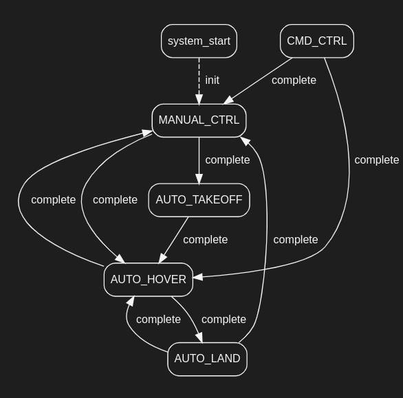

# quadrotor_fight_control
这是自主飞行器系统控制框架的文档，包含了该系统的定义，输入输出，算法和状态机。该文档的主要目的是为了让开发人员能够更好地理解系统的结构和工作流程。其中包含了一些具体的技术细节，如输入输出信息的格式和算法的实现思路。
## 环境配置
- ROS1 Neotic
- Ubuntu 20.04

## 功能定义
该系统负责执行规划模块优化出的指令。

由于系统本身无法获取当前位置信息，因此需要接入外部位置速度估计或者Odometry才能正常使用。
Px4的offbroad模式允许上位机程序直接控制飞行器姿态甚至角速度，因此无人机在飞行过程中大多采用offboard模式.

## 输入
输入由两个消息组成，一个是来自规划模块的消息，**包括目标位置、速度、加速度和jerk等信息**，以及一个来自全局定位的消息，**包含当前位置信息**。这些消息被控制框架用于计算成Px4可执行的命令，**包括姿态角度和油门值等信息**，并将这些命令发送到Px4控制器以控制飞行器的运动。

1. **Command message**

| Message Topic | /cmd |
| --- | --- |
| Message Type | PositionCommand(custom msg) |
| Information included | 目标position，velocity，acceleration,jerk均为三轴 |
| Documentation |  |

2. **Odometry message**

| Message Topic | /odom |
| --- | --- |
| Message Type | odometry |
| Information included | 世界坐标系下位置，当前速度 |
| Documentation | http://docs.ros.org/en/noetic/api/nav_msgs/html/msg/Odometry.html |
## 输出
输出是一个消息，**包含飞行器的姿态角度和油门值等信息**，以便控制飞行器的运动。这个消息被发送到Px4以执行命令。
| Message Topic| /mavros/setpoint_raw/attitude |
| --- | --- |
| Message Type | Attitude Target |
| Information included | Three-axis attitude angle (orientation) + throttle. Other information (body_rate) is ignored in the framework. |
| Documentation | http://docs.ros.org/en/api/mavros_msgs/html/msg/AttitudeTarget.html |

## 算法概述

### 输出的计算
这里最终的目标是
1. 将期望加速度(x轴与Y轴)转换成飞行器倾斜的目标角度(pitch，roll)
2. 将 目标位置（yaw）设为cmd的yaw
3. 将 期望加速度(z轴) 转换成油门值

**注：** 这里的坐标系是一个z轴平行与重力方向的坐标系。程序里只提供控制姿态角的程序，没有控制角速度(body_rate)的程序。
### 油门映射优化

思路假设 油门到加速度是一个线性关系即

当前加速度=系数*油门值(35~45ms之前的油门值，由于控制滞后)

在悬停时不断对这个函数进行优化。

在准备起飞(MANUAL_CTRL->AUTO_TAKEOFF)或者手动控制时会重置这个值。

## FSM

| State | Description |
| --- | --- |
| MANUAL_CTRL |手动控制，非offboard模式 |
| CMD_CTRL | CMD topic 中的指令生效，规划模块接入控制|
| AUTO_HOVER | 悬停模式，类似与定点模式，遥控器的指令被转换为位置量的变化 |
| AUTO_LAND | 自动降落 |
| AUTO_TAKEOFF |自动起飞 |

## 遥控器的数据处理

Px4 全程运行在 offboard 模式下，RC的数据直接在quadrotor_fight_control 中进行处理.
| Channel | Function |
| --- | --- |
| CH0-3 | 4 remote control channels |
| CH4 | Hover mode |
| CH5 | Command mode |
| CH7 | Reboot MCU |

## 无人机状态监测

## 其他
控制频率默认是100hz